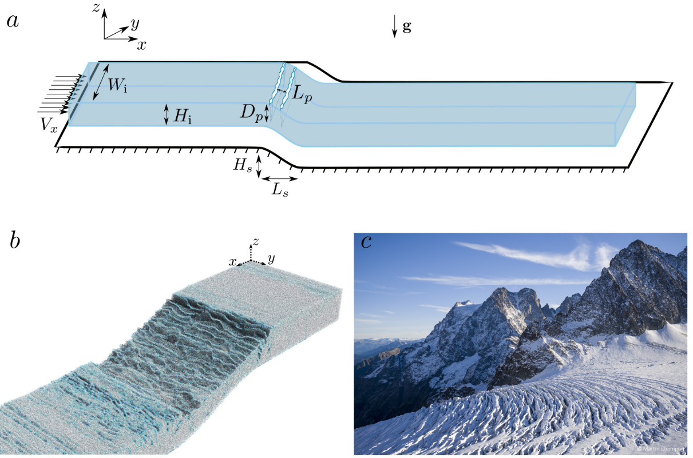
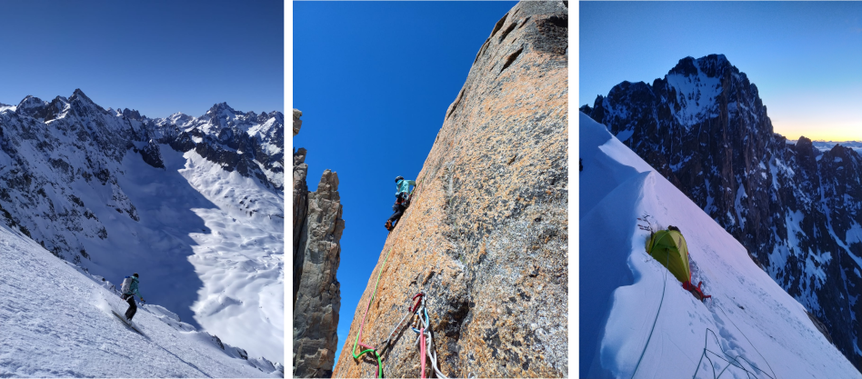

You can download my full CV: [CV](pdfs/cv.pdf)

I grew up in Grenoble (France) before going to Savoie where I did a high school specialized in mountaineering. 
Then, I completed an engineering school in "mechanics and energetics" in Marseille (France) and a master's degree on multi-phase flows. I've always been fascinated by the earth surface processes and particularly those that I can observe while I'm in the mountain or on the sea. For these reasons I did a PhD in Geophysics at INRAE Grenoble (France). 

__During my PhD__ with P. Frey (INRAE) and J. Chauchat (LEGI), __I studied the size segregation mechanism happening in sediment transport in mountain streams__. We derived a Lagrangian model to identify the forces acting on a large particle segregating in bedload transport. From this we developed a multi-phase flow model describing the behaviour of an ensemble of different particle sizes in bedload transport. In parallel experiments on a large particle segregating in bedload transport were conducted to better understand the processes and improve the Lagrangian model.

Then, I spent __two years at the University of Zurich and ETHZ__ with M.P. Lüthi and J. Gaume (SLF, ETHZ) where we developed and __use a Material Point Method to model fractures on glaciers__. I also descovered glaciology working on the comprehension of episodic basal, englacial and lateral influences on Sermeq Kujalleq (Jakobshavn glacier) in Greenland. 

__I am now working at IGE-Grenoble__ under the supervision of F. Gimbert, to work on the role of water on fracture propagation in glaciers. This reasearch are part of the REASSESS ERC Grant which aims to understand the role of melt water on the dynamics of Greenland's glaciers.

Beside my research, I spent a lot of time in the mountains, climbing, skiing or flying. I really like the idea of sneaking into isolated and steep landscapes where we can get through unexpected paths. I find it particularly aesthetic and stimulating as it teaches perseverance, imagination and gives a different perspective on our environment. Most of all, it provides an unequalled way to share memories and laugh with friends. 

